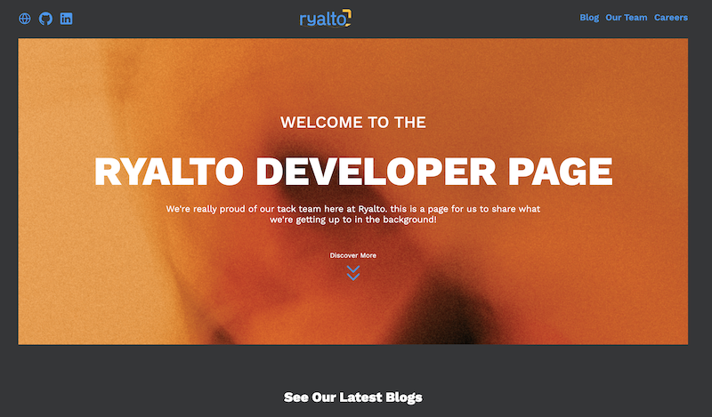

# ryalto-dev

## Deployment

:rocket: **Deployed** with Netlify at [ryalto-dev](https://ryalto-dev-design.netlify.app/)

## About

Redesign of the Ryalto Developer Page in **HTML** & **CSS**. 

## Instructions

Clone down to local machine, `cd ryalto`.

Run with live server extension to view it in your browser.

## Wins

-[x] Used **Figma** to produce wireframes.

-[x] Mobile first design with modern CSS functions to avoid many media queries.

-[x] Made responsive layouts with **CSS Grid** & **flexbox**.

-[x] Smaller images generated with **Webp** for supported browsers with **Picture element tag**.

-[x] Used **semantic** HTML tags,  **aria labels** and alt tags to increase accessibility.

